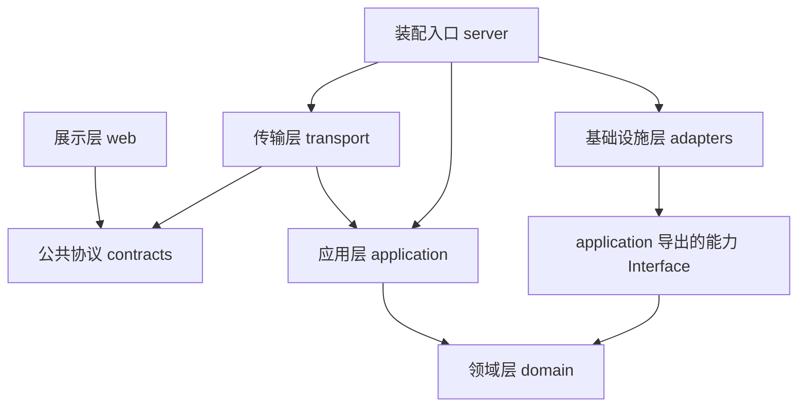
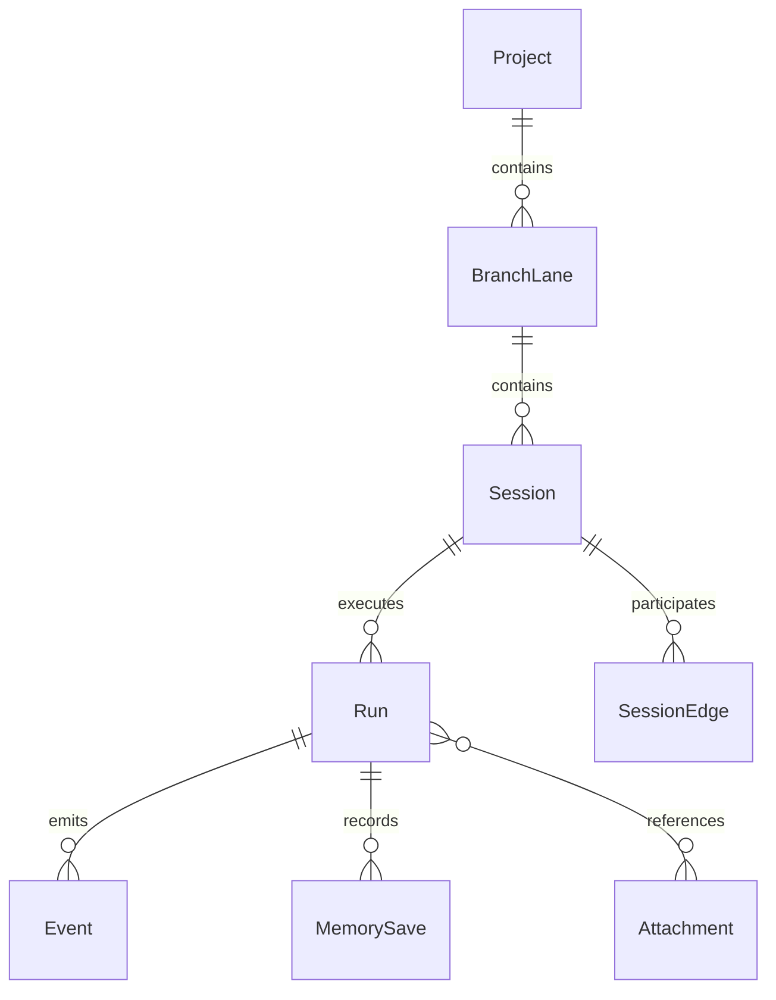
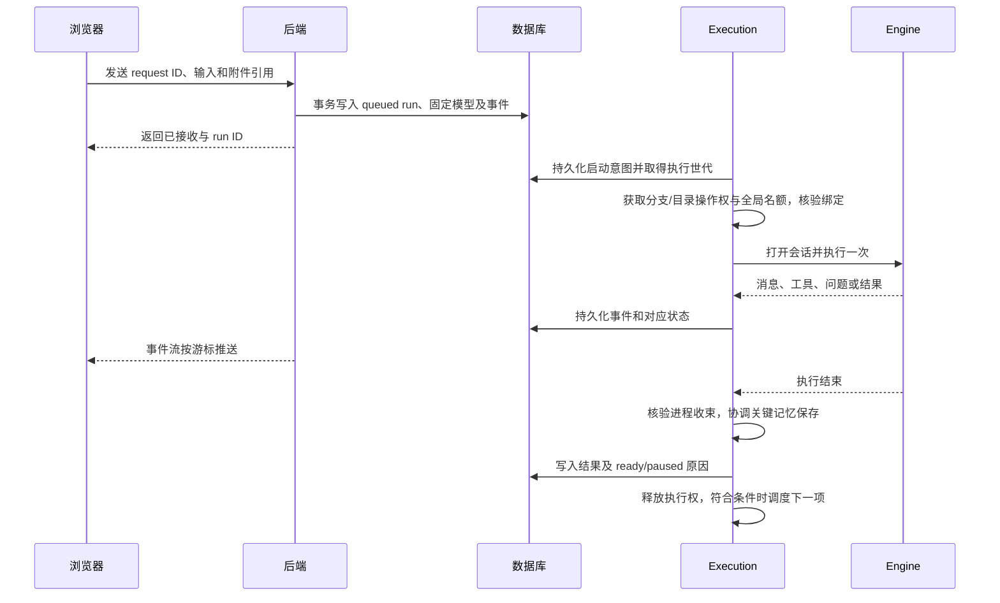

# parallel_pi 技术架构 v0.3（已确认）

日期：2026-09-16。状态：用户已确认架构基线，前端采用 Vue 3；应用未实现，V01–V04 已有 Linux 可控集成探针证据，见 [验证记录](validation.md)。本文细化 [MVP 规格](mvp-spec.md) 第 9、11 节，不替代其产品行为契约。已确认的 C01–C14 保持不变；本次确认覆盖五层职责、源码依赖、包映射和本文的架构默认方案；具体接入方式、版本与技术可行性仍由 V01–V04 验证。架构确认不表示技术验收已通过，也不扩大尚未确认的产品交互或视觉范围。

用户已确认的补充约束：

- 优先支持 **Linux 和 macOS**，两个平台都纳入首版验证；Windows 暂不纳入。
- **手动检查上游更新**，自动检测以后再补；升级仍经过兼容验证。
- **omp 支持暂不考虑**，需要时再设计，不安排迁移、双内核共存或 omp 兼容验证。
- 采用**明确的多层独立架构**，方便分别维护和修改。第 2 节的具体分层、依赖与包映射已确认。
- 前端采用 **Vue 3 + TypeScript**，替换此前的 React 建议；其余架构方案按本文基线执行。

pi 接入隔离服务于当前维护和上游升级，不以未来 omp 为由设计多内核框架。这里的独立指依赖受控、Interface 清晰、可独立测试与替换实现，不要求各层部署为独立进程或各自发布版本。

## 1. 已确认方案与设计取舍

采用本地单体后端、浏览器 UI、独立内核子进程。后端统一拥有调度和应用数据；内核拥有模型执行与原生会话；MWF 拥有长期记忆语义。

| 选择 | 已确认方案 | 原因与代价 |
| --- | --- | --- |
| 应用实现 | TypeScript；前端采用 Vue 3，后端使用固定受支持版本的 Node.js | 共享应用协议类型；具体版本、后端框架和数据库驱动在探针后锁定，不能反过来限制内核 |
| 内核隔离 | 独立子进程，优先验证 pi RPC；必要时独立进程包装 SDK | 内核异常与全局队列分离；需要管理进程生命周期与流协议 |
| 元数据 | SQLite 单写入者；大附件与原生会话放应用数据目录 | 本地部署简单；文件与数据库之间需要显式对账 |
| 浏览器通信 | HTTP 命令、快照查询，加 SSE 事件流 | 回复问题和停止仍用命令；重连凭游标恢复，具体传输不进入领域模型 |
| 内核接入 | 应用拥有窄的 Engine Interface，由 Pi Adapter 实现 | 集中处理 pi 升级与 RPC/SDK 差异；暂不设计其他内核 |
| 上游维护 | 子模块锁定提交，尽量零上游补丁；升级经过兼容验证 | 容易获取更新，但仍需承担破坏性接口变化的适配成本 |

Vue 3、TypeScript、Node.js、SQLite 和 HTTP+SSE 已确认为技术组合；探针已固定 pi/MWF 及验证依赖；正式应用的具体版本、后端框架、数据库驱动及地图组件库仍待选定。首版优先支持 Linux 和 macOS；子进程收束须在两个平台分别验证，不能用 Linux 结果代替 macOS 结果。

## 2. 分层、依赖与独立维护

### 2.1 五层职责

采用单仓库中的独立包组织。分层按变化原因划分，每层内部再按领域能力组织 Module；不是把每个实体都拆成一个包。

| 层 | 职责 | 允许了解 | 禁止承担 |
| --- | --- | --- | --- |
| 展示层 Presentation | 地图、会话、表单、草稿缓存与交互 | 公共请求/响应/事件协议 | 分支调度、Git 命令、pi 类型、数据库访问 |
| 传输层 Transport | HTTP 路由、输入校验、会话校验、SSE、错误映射 | 应用用例 Interface 与公共协议 | 自行决定队列顺序、直接操作数据库或启动 pi |
| 应用层 Application | 添加项目、发送/停止/恢复、创建/分叉、提交、保存记忆等用例；协调事务与外部操作 | 领域模型、自己声明的能力 Interface | 导入 SQLite 驱动、Git CLI、pi SDK、HTTP 框架或 OS 进程实现 |
| 领域层 Domain | Session/Run/Lane 规则、合法状态迁移、模型选择规则、调度决策 | 自有实体、值与显式输入 | 文件/网络/数据库/进程访问、依赖浏览器或 Node.js 专有接口 |
| 基础设施层 Infrastructure | Pi、Git、SQLite、文件附件、MWF、平台进程监督等 Adapter | 应用层能力 Interface 和领域值 | 重新定义产品状态规则、依赖 UI/路由、跨 Adapter 访问私有实现 |

这里的层不是全都按编号上下调用。**源码依赖指向规则与 Interface；运行时通过注入的 Adapter 完成外部操作。** 应用层不导入基础设施层，基础设施层导入应用层声明的 Interface 并实现它。



上图只表示源码依赖，不表示浏览器通信链路。运行时链路为 `Web → HTTP/SSE → 应用用例 → 注入的 Adapter → pi/Git/SQLite/MWF`。只有装配入口可以同时导入传输、应用和基础设施实现，负责创建对象、注入依赖及启动/关闭。它不包含业务规则。

### 2.2 包与目录映射

```text
apps/web/                        展示层；仅消费公共协议
apps/server/                     装配入口；配置依赖与启动/关闭
packages/contracts/              请求、响应、事件 schema；无业务实现
packages/transport/              HTTP/SSE 到应用用例的映射
packages/domain/                 纯领域模型、状态机与调度规则
packages/application/            用例与能力 Interface
  execution/                     执行协调、恢复与分支操作权
  workspace/                     项目、工作区与提交用例
  session/                       会话图与原生历史协调
  configuration/                 配置来源与修改用例
  memory/                        记忆保存、纠正和重试用例
  ports/                         外部能力 Interface 的公开入口
packages/infra-pi/               pi 协议、会话格式与事件转换
packages/infra-git/              Git 命令与仓库事实读取
packages/infra-storage/          SQLite 事务、附件、应用数据迁移
packages/infra-mwf/              MWF runtime 调用与结果转换
packages/infra-platform/         Linux/macOS 进程监督、路径与实例锁
vendor/pi/                      后续引入的原版子模块
probes/                         V01–V04 真实集成验证
```

这些是计划中的 workspace 包，不是现在创建的空工程。各包通过自己的公开入口导出，禁止跨包引用 `src/internal` 等私有文件。Domain 不通过一个大 `shared` 包间接获得平台依赖；contracts 只保留网络可传输的数据与验证 schema，不导出数据库行、内核事件或完整领域对象。Transport 显式完成应用结果与公共协议的映射。

### 2.3 Interface 所有权与深模块

Module 的 Interface 包括行为、不变量、失败方式及调用时序。按实际能力设置 seam，避免为每个函数增加一层纯转发。

| 应用拥有的 Interface | 谁实现 | 对调用方隐藏什么 |
| --- | --- | --- |
| Engine | infra-pi | JSONL/SDK、原生会话格式、fork 边界、内核错误与事件转换 |
| WorkspaceAccess | infra-git | Git CLI、共同仓库身份、worktree、index 与钩子处理 |
| AppStore / AttachmentStore | infra-storage | SQL、schema 迁移、文件落位与读取；提供明确的应用事务语义 |
| MemoryAccess | infra-mwf | MWF 调用、修订检查、原生记录引用与错误映射 |
| ProcessSupervisor / InstanceLock | infra-platform | Linux/macOS 进程身份、启动/收束、实例排他与平台差异 |

能力 Interface 可按实际调用方拆分读写视图，不要求做成包含所有方法的巨大对象。Application 决定“哪些状态和事件必须一起提交”，AppStore 承担原子执行；数据库连接和 SQL 不穿过 Interface。数据库事务不跨模型执行或任意 Git 命令，跨存储操作仍按第 4 节的意图与对账流程处理。

Execution 协调用例的分支操作权。Session、Workspace、Memory 的公开写用例通过共同的操作协调器进入；协调器提供执行许可，不反向调用这些用例，从而避免互相导入形成循环。Domain 决定是否合法，Application 决定何时调用外部能力，Adapter 负责真实执行并返回事实。

Pi Adapter 的正常取消走 pi 协议，强制收束由平台监督能力处理；它只接收应用声明的 ProcessSupervisor Interface，不导入 infra-platform 实现。该实现由装配入口注入。其他 Adapter 之间也按此规则协作。

### 2.4 独立测试、修改与依赖检查

| 修改情景 | 主要影响范围 | 保持稳定的约束 |
| --- | --- | --- |
| 调整地图布局或换 UI 框架 | web | 公共协议与后端规则不变 |
| 修改同分支排队或暂停规则 | domain + application | Pi Adapter 不决定调度策略 |
| 跟随 pi 升级或改用 SDK worker | infra-pi，必要时装配/内核构建 | 兼容 Interface 时不改 UI 和领域规则；行为变更须显式审查 |
| 修改 SQLite schema 或附件存储 | infra-storage | 应用事务语义和恢复约定保持成立 |
| 修复 macOS 子进程收束 | infra-platform | 应用层仍使用统一的收束证据与失败语义 |

实施时用包依赖白名单、公开导出入口检查和循环依赖检查落实规则，连类型导入也不能绕过。Domain 独立构建并运行纯逻辑测试；Application 注入可控替身验证幂等、暂停和崩溃窗口；各 Adapter 用真实 pi/Git/SQLite/MWF 做契约测试；Transport 验证协议映射；UI 可用公共协议样本独立开发。最后仍需真实纵向集成测试。

独立可测试不表示没有联动：公共 Interface 改动必须检查所有调用方；破坏性协议变化需明确版本策略。首版包可以一起发布，不引入逐包独立发版流程。

### 2.5 部署与进程

五层不等于五个进程。首版仍是一个本地后端、浏览器和受监督的 pi 子进程；领域层与应用层均在后端中运行。MWF 扩展从 pi 内执行时是内核集成路径，UI 发起的记忆操作经应用层与 MWF Adapter，二者仍遵守同一写入协调约定。

分层的实际验收标准：拿掉 Web 可以通过用例测试驱动应用；拿掉 pi 可用替身验证队列规则；更新 pi 协议不需要在 UI、领域层搜索并改写原生事件类型；Linux/macOS 差异集中在平台实现。这些目前是实施要求，尚无代码证明已达到。

## 3. Engine Interface 与 pi 接入

### 3.1 Interface 草图

以下是职责描述，不是承诺内核具有同名函数的 TypeScript 声明。V01 决定具体调用形状。

| 能力组 | 输入与输出 | 必须保持的语义 |
| --- | --- | --- |
| describe | 返回内核身份、版本、能力和兼容信息 | 能力基于固定版本实测；UI 只展示可履行的操作 |
| session | 创建、打开、列出可分叉点、分叉、读取历史；使用不透明引用 | fork 返回真实继承边界及可能的待编辑文本；不恢复代码 |
| execute | 接收 run ID、会话引用、已核验 cwd、固定模型、文本和附件 | 一次启动对应一个 run；返回受控执行句柄；不使用内核队列替代应用队列 |
| control | 对指定执行句柄回答问题、取消、查询收束情况 | 回答绑定 question ID；取消请求成功不等于工具已经停止 |
| observe | 输出规范化事件及可关联的原生记录引用 | 保留事件顺序、错误来源和完成原因；未知影响正确性的事件不能静默丢弃 |
| configuration | 查询模型/配置来源，按修订更新原生连接配置 | 不把凭据放入应用事件；不在内核间自动复制凭据 |

能力描述至少区分图片、历史恢复、分叉点类型、结构化提问和可验证取消。MVP 必需能力缺失时，验证判为不通过或明确改用 SDK worker，不能用隐藏按钮掩盖需求缺失；可选扩展能力可以禁用。

规范化事件建议包括消息增量、工具开始/输出/结束、等待回答、执行结果和适配错误。每个持久化事件包含应用 session/run ID、递增游标及 schema 版本。Engine 内部原始事件不成为前端公共类型；需要诊断的原始数据仅作受控本地日志，避免保存密钥。

### 3.2 RPC 与 SDK worker 的取舍

两者均位于同一个 seam：调度器只看到 Engine Interface。

- **RPC 优先探针**：验证真实会话恢复、分叉边界、图片、提问以及停止后的进程状态。协议解析、请求关联、stdout/stderr 分离均放在 Pi Adapter。
- **SDK worker 备选**：RPC 无法满足已确认语义时，在独立进程使用 SDK；上游对象和类型仍不暴露给应用。内部路径依赖若不可避免，登记版本与升级验证项。
- 不为维持某种接入方式改变产品中的“会话”“分叉”定义。两条路径都失败时记录缺口，回到讨论阶段。

推荐一个活动 run 对应一个受监督执行进程，结束后关闭；继续会话从原生历史恢复。它比长期缓存每个 session 进程更容易核验隔离，但有启动开销。V01 测量恢复和扩展启动成本后再决定是否复用空闲进程。等待回答期间进程继续存在并占用名额。读取/分叉等辅助进程同样受监督，写操作仍持有分支操作权。

### 3.3 当前接入范围

当前只设计 Pi Adapter，Engine Interface 放在 application 的 ports 中，pi 专属类型和原生会话解析留在 infra-pi 内。记录 pi 构建版本和原生引用是为了升级与恢复对账，不增加内核选择器、双内核调度或迁移字段。

omp 的接入、旧会话迁移和运行方式以后有实际需求时再设计。本轮保留的 seam 用于 pi 的 RPC/SDK 差异、版本演进和应用测试，不据此承诺未来其他内核无成本接入。

## 4. 数据归属与持久化

### 4.1 唯一权威来源

| 数据 | 权威来源 | 应用允许保存的派生内容 |
| --- | --- | --- |
| 项目、会话图、队列、run 状态、操作意图 | 应用 SQLite | UI 快照与索引 |
| 模型上下文、原生会话树 | 内核原生会话文件 | 只读历史投影、原生 entry 引用及最后同步位置 |
| 代码、HEAD、index、worktree | Git 与工作目录 | 带观测时间/基准的 diff 信息，不是代码快照 |
| 长期知识与偏好 | 对应 worktree 的 MWF 文件 | ID、来源、保存状态；不维护第二份可编辑权威正文 |
| provider 凭据与内核配置 | 选定内核的原生机制 | 应用只存模型选择及来源，不复制凭据 |
| 草稿、视口、附件、每次 run 交接记录 | 应用本地数据区 | 浏览器缓存，按修订与后端对账 |

建议应用目录由平台数据目录解析为 `<app-data>/parallel_pi/`，包含数据库、按稳定 ID 路由的 sessions、attachments、run-records、操作暂存和备份。完整聊天与附件不进入用户项目 Git。应用管理的 worktree 放独立目录，已有检出目录继续原地使用；目录删除不作为首版功能。

### 4.2 最小数据关系



| 实体 | 关键补充字段与规则 |
| --- | --- |
| Project | 稳定 ID、规范化共同 Git 目录身份、显示路径；remote URL 不是本机仓库身份 |
| BranchLane | 稳定 ID、完整本地 ref、worktree 绑定及修订、ready/paused/recovering 与原因 |
| Session | lane ID、pi 原生会话引用、创建/最近写入版本、当前 entry、模型选择 |
| SessionEdge | 父/子 ID、continue/fork、不可变源 entry；只允许同 lane，保持无环 |
| Run | request ID、输入摘要、附件、入队模型、内核构建引用、状态、执行世代与进程归属 |
| Operation | 创建/fork/准备工作区等意图、目标 ID、pending/completed/failed/uncertain 及对账证据 |
| Event | 全局递增游标、run ID、事件类型与版本；与对应应用状态在同一事务提交 |
| MemorySave | 来源、待写内容引用、目标记录、预期修订、幂等键和保存状态 |
| Draft / ViewState | 按项目/session 分别存储，带修订；预览 selection 与 active session 独立 |

`Run` 的执行结果和 `MemorySave` 状态正交：成功执行可以同时显示记忆保存失败。关键保存未完成时暂停该 lane；用户明确继续的操作也留记录。

### 4.3 文件与数据库不是一个事务

先持久化操作意图及稳定目标 ID，再调用内核或写文件，最后绑定真实引用并提交结果。创建/fork 未对账完成不显示成可进入的成功节点。

附件先写临时文件、校验并原子落位，再在事务中建立引用；无引用文件作为待清理候选，不自动删除未知原生会话。备份恢复后检查文件引用完整性。

同一 request ID、同一内容的重复发送返回原 run；同一 ID 携带不同内容返回冲突。数据库记录了“准备发送”但崩溃时无法确认内核是否接收，标为不确定/中断，核对原生历史后处理，**不能自动补发**。应用能避免可识别的重复提交，但不承诺跨数据库、模型与任意工具的 exactly-once 执行。

## 5. 执行权、队列与进程监督

单个后端持有应用数据目录的排他实例锁；第二个后端实例拒绝成为另一个调度者。分支锁键使用规范化仓库身份和完整 ref，同时对真实工作目录互斥。不同路径别名不能产生第二个写入者。

分支操作权涵盖 run、会话分叉/修改、提交和应用发起的记忆写入。全局模型运行名额默认 2，等待回答占名额；维护操作使用分支操作权，但不额外占模型名额。内核已经执行中的记忆调用属于该 run 的操作范围，不能递归申请自己持有的锁。

分支内建议 FIFO，跨就绪分支公平选择。临时资源不足保持 queued；已选任务遇到不可恢复的绑定/模型/启动错误时失败并暂停该列。暂停原因分别记录执行失败、用户停止、关键记忆失败或恢复待核验，避免一个“恢复”按钮掩盖尚未满足的条件。



Engine 报告完成后，模型运行名额可在确认收束时释放；关键记忆保存尚未完成时，lane 仍不可开始后项。记忆保存失败后释放操作锁并保留 paused 状态，允许用户重试或纠正，不能把锁永久占住。

进程监督在 Engine 内核协议外由 Execution 协调：记录启动世代、进程身份与平台监督句柄，停止先请求取消，再按超时策略收束。单靠 PID、时间超时或数据库租约过期不足以证明旧写入者消失；防止 PID 重用误杀。无法核验时保留 recovering 并阻止重用工作区。

Linux 和 macOS 的进程监督分别列入 V02，包括取消、后端崩溃、PID 重用以及工具脱离进程组后的收束验证。平台差异集中在 infra-platform，不能假定两个 Unix 平台行为相同。Windows 不在当前验证范围内。若普通进程组不足，应选择更强的监督容器或明确报告未收束；不得假报安全。应用协调不了用户在外部终端进行的所有写入：每次执行前和提交前重新核验绑定/内容，运行中发现 ref 改变则停止并暂停，不宣称 worktree 是沙箱。

## 6. 失败、重连与重启

| 情况 | 处理与恢复 |
| --- | --- |
| 刷新、关闭网页、切项目 | 后端继续执行；重连读取快照和游标，不重发 prompt |
| 事件落盘失败 | 不发送虚假的成功状态；停止后续调度并尝试收束当前执行，恢复后对账原生记录 |
| 内核异常退出 | 核验相关进程；run 失败或中断，该列暂停，其他列按资源条件继续 |
| 用户停止 | 先进入 stopping，收束后 cancelled 且列暂停；未确认收束不能释放工作区 |
| 后端重启 | 原活动 run 标 interrupted，受影响列 recovering；未启动项仍 queued；核验旧进程后转 paused，由用户决定继续 |
| 关键记忆保存失败 | 保留待写内容，暂停该列；重试指定保存任务，不重跑模型 |
| 外部修改配置/记忆 | 比较修订；冲突保留双方内容并要求选择，不盲覆盖 |
| 内核版本或原生会话不兼容 | 保留历史与错误原因，阻止继续/分叉，不隐式转换或换模型 |

浏览器建立事件流前取得带游标的快照，再订阅该游标之后的持久化事件；允许重复送达，由游标去重。游标过期则重新取快照。后台输出必须先持久化再推送；大工具输出可以分块存储并引用，避免事件表无限保存重复正文。保留策略另行决定，首版不自动删除原生历史。

草稿建议浏览器即时本地缓存并按修订同步到后端，附件先持久化。多标签页同一草稿冲突可检测，不以最后写入静默覆盖。浏览器突然退出前尚未同步的编辑不能宣称已保存。

## 7. 配置、记忆和本地服务

项目/session 默认模型是应用选择，provider 目录与认证能力来自内核配置。入队时解析并固定 provider/model；执行时再次验证可用性，但不静默替换。运行中的配置变更只影响之后适用的操作，已有 run 不重解析模型。

建议保留用户原有 pi 配置语义，通过 Configuration Module 调用已验证的配置入口；多个 worktree 如何映射项目设置留 V03。应用与外部 pi 同时编辑时需比较修订，写入只改目标字段。凭据不进入事件、URL、草稿、日志和 MWF。

MWF 沿用每个 worktree 的原生目录与跟踪选择。应用只协调 UI 纠正与关键交接保存；agent 按需召回/写入走固定版本的 MWF runtime 与扩展。二者必须尊重同一记忆写入锁和修订规则。每个 run 的日志与交接由应用单独保存，不覆盖 MWF 的单份项目 handoff，也不发明 MWF schema 字段。V04 检查运行时是否支持所需幂等与冲突处理；缺失时在应用保存任务中对账，不能声称重试天然安全。

后端仅监听 loopback，验证 Host/Origin，命令和事件流使用本地会话校验；不开放任意文件路径下载接口。Markdown 与工具输出按不可信文本处理。此处延续规格第 9 节的本地服务要求，不扩展为多用户权限系统。

## 8. 跟随上游更新与回退

用户已确认手动检查上游更新，自动检测留待后续。手动检查后由可重复流程完成版本比较、构建、兼容测试与采用；首版不在启动时自动拉取 main，也不在运行中热替换内核。

建议维护一份构建清单，记录 pi commit、适配器版本、MWF/扩展版本、运行时版本、依赖锁与应用数据 schema 版本。子模块固定源码并不自动固定其全部依赖，构建必须使用对应锁文件。研究文档中的 SHA 仅是参考，尚不是选定版本。

升级流程：

1. 在升级分支更新 pi 子模块及必要依赖，检查许可证和接口差异；应用补丁尽量放在 Adapter/扩展中，必须改上游时单独记录补丁和原因。
2. 运行 V01–V04 兼容套件，包括上一受支持版本的会话样本；在副本上验证打开、继续、fork、取消、配置和 MWF。
3. 输出候选版本、通过/失败项和不兼容项。自动检测或更新 PR 留待后续需求，不属于首版实现。
4. 切换实际使用版本前停止接收新任务，等待执行和记忆写入收束；未启动项保留。建议存在排队项时阻止升级，待用户处理，避免改变其绑定的内核构建。
5. 在静止状态备份 SQLite、原生会话、附件、应用记录和相关配置/记忆；记录版本清单，再执行数据迁移和内核切换。
6. 运行启动与恢复检查，再开放新任务；失败则按备份清单恢复。不得为回退应用而自动回滚用户代码或覆盖升级后的新工作。

回退内核代码和回退数据是两件事。新版本已经写入的数据未必可供旧版本读取；保留新数据副本，只有确认兼容或明确恢复升级前备份后才能回退。备份中的配置可能包含秘密，应保持本地受限访问，不加入 Git。

## 9. 验证与实施顺序

本节保留完整验收计划；Linux 已执行的探针、已知缺口与未验证项见 [验证记录](validation.md)。DeepSeek `deepseek-flash` 真实调用已通过，macOS 仍未执行。V01–V04 在 Linux 和 macOS 分别记录结果；任一平台缺少运行证据时，不能报告该平台已通过。单元替身用于状态机与故障注入；真实固定版本内核用于兼容结论，两者不能互相替代。

| 阶段 | 交付与关键实验 | 退出条件 / 对应规格 |
| --- | --- | --- |
| V01 内核 | 固定 pi；可复现适配探针；消息/工具/图片/提问；恢复/fork；取消和不确定发送；旧版本样本升级 | 能准确实现 Engine Interface，报告 RPC 或 SDK 选择；A04、A07、A10、A11、A15 的内核部分 |
| V02 工作区与执行 | 隔离测试仓库两个 worktree；串行/并行；别名去重；重复请求；停止/杀后端/残留工具/第二后端实例；创建与启动各崩溃窗口 | 不发生第二写入者或自动重放，暂停与恢复证据完整；A01、A02、A05–A09、A13 的后端部分 |
| V03 配置 | 全局/项目/session 来源；模型入队固定；多 worktree；凭据缺失及外部并发编辑 | 配置语义和兼容范围明确，无静默替换；A10 |
| V04 记忆 | 固定 MWF/adapter；召回/保存/修订冲突；故障与幂等重试；跨 worktree 跟踪策略 | 保存失败可见、可恢复；运行成功与保存成功分离；A12、A15 的记忆部分 |
| 纵向闭环 | 添加项目 → 创建 session → 文字/图片执行 → 持久化 → 刷新/重启恢复 | 真实 UI 与真实内核贯通，不能用静态线框或 mock 宣称完成 |
| MVP 补齐 | 地图与分叉、模型设置、记忆纠正、diff/提交；键盘与窄窗口 | 执行规格完整 A01–A16，记录实际支持平台与限制 |

每份探针报告记录版本、环境、命令、样本、预期/实际行为和未通过项。建议 V01 起保留 pi 行为契约套件用于后续升级；协议专属测试留在 infra-pi 内。应用骨架建立时同时启用第 2.4 节的依赖检查，阻止层间反向引用和循环。

## 10. 架构决策与验证落点

用户确认前端改用 Vue 3，并确认当前架构。Q1–Q7 的架构决策已收敛，保留编号供追踪；Q4、Q5 的实际接入与运行行为由 V01 验证，不再作为待用户表态的架构问题。

| ID | 决策项 | 已确认基线 | 验证与边界 |
| --- | --- | --- | --- |
| Q1 · 已确认 | 首版平台 | 优先 Linux 和 macOS | 两平台分别验证构建、取消、残留进程和恢复；Windows 暂不纳入 |
| Q2 · 已确认 | 上游更新检查 | 手动检查，自动检测以后补 | 保留兼容验证与备份回退，不实现后台检查 |
| Q3 · 已暂缓 | omp 支持与旧会话 | 目前不考虑，需要时再设计 | 不增加 omp 迁移、共存或兼容验证任务 |
| Q4 · 基线已确认，待验证 | 每个 run 启动进程还是常驻复用？ | 先每 run 一个，V01 测启动与恢复开销 | 常驻更快但增加切换、扩展状态和取消后的复用风险 |
| Q5 · 验证路径已确认 | 原生 RPC 还是 SDK worker？ | 先探测 RPC，已确认能力缺失时选 SDK worker | 技术实验决定，无需仅凭偏好提前冻结 |
| Q6 · 已确认 | 应用数据是否要跨机器携带？ | 首版本机数据目录加完整备份；不做同步 | 可移植包需要重映射路径、凭据与 worktree，属于额外工作 |
| Q7 · 已确认 | 前后端技术组合 | Vue 3 / TypeScript / Node.js / SQLite / HTTP+SSE | 具体库与版本探针后锁定；地图组件另行验证，核心领域与 Engine Interface 保持独立 |

## 11. 依据与当前交接

- 产品行为与验收：[MVP 规格](mvp-spec.md)、[设计评审](design-review.md)。
- 内核研究和固定参考提交：[pi / omp 分析](engine-comparison.md)。
- 记忆权威、适配与跟踪策略：[文件记忆设计](memory-design.md)。
- 前次已核对的官方接入资料：[pi RPC](https://github.com/earendil-works/pi/blob/main/packages/coding-agent/docs/rpc.md)、[omp SDK](https://github.com/can1357/oh-my-pi/blob/main/docs/sdk.md)。这些 main 链接用于定位资料；实际实现以探针锁定提交为准，本文不以它们声称兼容性通过。

本轮将前端改为 Vue 3，并记录用户对当前架构基线的确认，同步文档与可视化；没有添加子模块、安装依赖、建立应用骨架、调用模型或执行技术探针。下一阶段按第 9 节开展 V01–V04，将真实结果回写本文后锁定接入方式和具体版本。若探针发现与已确认约束冲突的真实缺口，应明确记录并调整方案，不能把架构确认当作兼容性通过。

## 12. 技术探针阶段更新

V01–V04 已按本节前述范围建立可复现 Linux 实验并分轮提交，应用实现尚未开始。实际固定版本、运行结果及缺口以 [验证记录](validation.md) 为准；第 11 节的“本轮”描述此前架构确认阶段。

当前继续采用原生 RPC；硬终止后 Bash 可能残留，平台监督不能只杀 pi 进程组。模型启动需核对真实可用目录。配置/MWF 修订检查已验证窄适配路径，但涉及固定版本内部 API，必须保留升级契约检查。DeepSeek 真实模型探针已通过，macOS 门槛尚未通过，不能把 Linux 探针当作全平台验收。
