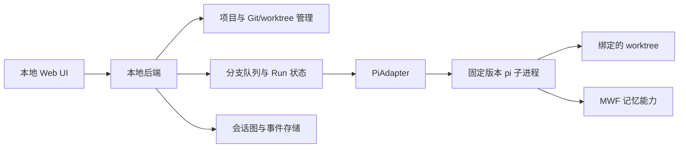

# parallel_pi MVP 设计 v0.1

状态：MVP 设计阶段基线；线框与四项关键默认行为已通过用户评审，其他 D 项保留为设计建议。不是实现完成报告。日期：2026-09-16。

本规格收敛此前讨论。标为 **C** 的条目来自用户确认；标为 **D** 的条目是本版设计建议默认值，尚未由用户逐项确认；**V** 为必须通过集成验证的技术假设。新指令优先；历史依据见 [讨论稿](mvp-discussion.md)、[界面讨论](ui-interaction.md)、[记忆设计](memory-design.md)。不把本稿新增默认值倒写为用户决策。

## 1. 产品目标与首版边界

用户在本机浏览器中选择 Git 项目，以分支地图查看开发活动，进入一个 session 工作，也可分叉或新建接续 session。各 Git 分支独立推进，同一分支下的思路共享当前代码。

| ID | 已确认的产品约束（C） |
| --- | --- |
| C01 | 本地单用户 Web UI，管理本机项目；原版 pi 通过 Git submodule 引入 |
| C02 | 一列对应一个本地 Git 分支；仅远端存在的分支以紧凑行呈现并可“拉取到本地”；可新建分支 |
| C03 | 一个地图节点就是一个多轮 session；思路从属于 Git 分支，切换/分叉思路不切换或回滚代码 |
| C04 | 同一 Git 分支串行，跨分支可并行；等待回答占用执行名额，失败暂停该列 |
| C05 | 固定目录记忆沿用 MWF 的分类、作用域、召回与跟踪设计；可查看、纠正，写入失败可见 |
| C06 | 地图占主体，单击 session 开右侧详情，双击进入会话；会话左上角缩略图单击开浮层、双击回全局 |
| C07 | 左下角设置入口上方为项目列表，新项目插在底部；切换保留位置、草稿和后台任务，入口显示状态 |
| C08 | 设置统一管理 API key 等连接信息；项目和 session 可各自选择模型，默认改变不影响运行中任务 |
| C09 | 保留并使用已有未提交修改；其他分支按需准备 worktree，不自动搬运修改 |
| C10 | 支持文字和图片、diff、用户明确触发的提交；合并交给外部 Git 工具；历史导入和删除暂缓 |
| C11 | 关闭网页不停止执行；后端重启后未完成运行标为中断，由用户决定继续方式 |
| C12 | 预览与工作分开，双击有显式按钮替代；返回恢复地图位置，切换会话不丢草稿 |
| C13 | 三张 SVG 线框通过用户评审，作为 MVP 布局基线 |
| C14 | 停止后暂停该列；每个 run 入队时固定模型；关键记忆写入失败暂停并允许重试或明确继续；全局并发默认 2，可配置 |

**MVP 不包含（C + 本版范围收敛 D）：** 多用户、远程工作节点、自动多 agent 编排、完整 IDE、历史代码回滚、对话语义合并、内置 Git merge、旧 pi 会话批量导入、删除历史。D：推送、分支删除、归档和任务完成百分比也不进入首版；保持查看、执行、记忆与本地提交闭环。

## 2. 信息架构与三个主要画面

静态线框仅用于布局评审，所有数据均为示例，不连接后端。入口：[线框图册](design/README.md)。

### 2.1 全局地图

- 左侧窄导航区底部：项目入口、添加项目、pi 设置。D：添加入口放在项目列表上方，不挤占最新项目紧邻设置的位置。
- 顶部：当前项目名、目录、项目模型、新建分支、刷新分支、记忆入口。
- 本地分支按列排列；每列标题显示分支名、执行状态、排队数、工作区是否就绪及变更入口。
- 仅远端分支放在顶部可折叠的紧凑行区域（D），不是完整的空列。行显示 remote/branch 和“拉取到本地”。
- 每列是 session 关系图。接续边标“接续”，历史分叉边标“分叉”；不把 Git commit 线混入同一语义。
- session 节点展示标题、最近运行状态、时间及一句结果。代码变更显示为观测信息，不宣称整个工作区 diff 都归该节点。
- 每个节点有新建接续入口；列底部有“新建独立会话”。多个根节点合法。
- 右侧详情初始收起（D）；单击节点后展开预览。面板展开不移动被点击节点，详见交互约束。
- 大量分支横向浏览，长历史按需加载；缩放/平移不改变领域关系。D：首版自动布局，不做自由拖拽重排。

### 2.2 专注会话

- 左上角是当前项目地图缩略图，高亮当前分支/session；旁有“查看地图”“返回全局地图”按钮。
- 顶部始终显示项目、Git 分支、session 标题与当前模型，避免跨项目误操作。
- 主体是用户/agent 消息及工具执行记录；长工具输出折叠，错误保留完整可查看内容。
- 输入区支持文字、图片选择/粘贴、附件预览和移除；主按钮按状态显示“发送”或“加入队列”。
- 当前会话运行时可停止；同分支其他会话运行时显示占用者及排队位置，仍能编辑草稿。
- agent 等待回答时展示问题和回复入口，回复交还给原 run，不创建另一个排队 run。
- 历史消息的“从此处分叉”只出现在内核可用位置。不会显示无法履行的任意工具中间点。
- 当前 Git 分支的 diff、队列及记忆可从辅助按钮打开；不把辅助内容永久挤入主对话区。

### 2.3 会话中的地图浮层

- 保留底层会话；浮层内复用同一个项目地图，单击预览、双击切换 session 后关闭浮层。
- 浮层不覆盖左上角缩略图，保证缩略图第二次点击仍可返回全局。
- D：这是非模态可关闭面板，不声称具有模态焦点锁。Esc 关闭面板并回到触发入口，底层会话不自动发送/停止。
- 单击其他节点只是预览；当前活跃查看的 session ID 不变，只有明确进入才切换。
- 浮层视口与全局地图视口独立保存（D），全局返回时恢复原位置。

## 3. 导航与界面一致性

| 动作 | 界面结果 | 不发生的副作用 |
| --- | --- | --- |
| 单击地图 session | 选中并展开详情 | 不提交 prompt、不切换代码 |
| 双击 / 点击“进入会话” | 进入该 session 的专注视图 | 不自动启动 run |
| 单击缩略图 | 开地图浮层 | 不离开当前 session |
| 双击 / 点击“返回全局地图” | 关闭临时面板，回到原全局视口 | 不停止后台执行 |
| 单击项目 | 切换项目，恢复其浏览状态与草稿 | 不重排项目列表、不停止其他项目（不重排为 D） |
| 在节点后新建接续会话 | 新节点及接续边，打开空输入 | 不复制完整聊天、不立即执行 |
| 列底部新建独立会话 | 新根节点，打开空输入 | 不默认选择最近会话为父节点 |

D：新添加项目后立即切到其全局地图；重复添加同一仓库定位已有项目。不同 worktree 通过共同仓库身份归入一个项目，不能重复产生独立调度锁。

单击与双击共享选择逻辑，最终只发生一次导航。详情面板覆盖地图右侧但不触发画布重排；若目标位于面板覆盖区，延后详情展开到双击判定结束（D，原型需验证），不能挡住第二次点击。画布拖拽、节点双击与缩放手势互斥。

按钮可键盘操作、有可见焦点。D：Enter 预览，显式按钮进入，Esc 只关闭最上层临时面板；中文输入法组字期间不触发提交快捷键。触控也可通过按钮完成所有流程。减弱动效时直接切换视图。

D：宽屏采用地图加详情；窄窗口详情覆盖展示，会话保留折叠项目入口与地图按钮，不强制三栏并排。首轮线框基于桌面使用场景，不承诺已完成移动端验证。

## 4. 项目与 Git 分支流程

### 4.1 添加本机项目

1. 点击“添加项目”，输入目录或通过后端提供的本机目录选择界面选择（D）；不把浏览器文件上传当成本机目录授权。
2. 后端验证目录与仓库身份，识别已有 worktree、当前分支、未提交修改、remote 和已知远端分支。
3. 成功后新项目出现在设置按钮上方，旧项目上移；显示本地分支列。失败保留输入并给出原因。
4. 现有未提交修改继续保留。D：尚无提交、bare 仓库、detached HEAD 暂显示具体处理提示，不自动初始化、提交或切换分支。
5. 记忆已有配置沿用；无配置时，首次初始化明确展示 track/ignore 选择，按 MWF 策略以共享记忆跟踪为默认，私有内容排除。

### 4.2 本地分支与 worktree

本地分支都可显示；显示一列不等于立即创建工作区或启动 pi（D）。首次需要执行时复用适合的已有检出目录，否则准备独立 worktree。准备失败保留列与历史，禁用发送并显示重试原因。

开始 run 前核对仓库、分支和实际目录。若用户在终端切换了分支、删除了目录或正在 merge/rebase 冲突中，暂停执行并提示恢复，不能悄悄改写绑定。原有 dirty 状态本身不是错误。

### 4.3 仅远端分支

D：展示已知 remote refs，并显示刷新时间；“刷新远端”更新列表，失败保留旧列表并标记过期。“拉取到本地”获取所选远端分支并建立对应本地分支/跟踪关系，成功后将紧凑行替换为本地列，不向当前分支合并。

同名 remote 用完整 remote/branch 区分；本地名称冲突时提示选择已有分支或输入新名称，不覆盖。识别是否已有本地分支优先使用跟踪关系，并处理同名但不同来源的分支（D）。

### 4.4 创建 Git 分支

输入名称并选择起点。D：默认当前选中分支的已提交 HEAD；明确提示未提交改动不会随之复制。成功后新列出现，原工作区不被切换。名称不合法、已存在或起点失效均保留表单供修改。

## 5. Session、思路与执行流程

| 操作 | 会话上下文 | 图关系 | 代码 |
| --- | --- | --- | --- |
| 继续原 session | 原生历史及当前路径 | 原节点 | 当前分支工作区 |
| 从历史位置分叉 | 固定源 entry 的有效历史；精确边界由 V01 验证 | 新 session + fork 边 | 当前分支工作区，不回滚 |
| 新建接续 session | 新上下文 + 按需记忆 | 新 session + continue 边 | 当前分支工作区 |
| 新建独立 session | 新上下文 + 按需记忆 | 新根节点 | 当前分支工作区 |

D：分叉弹层明确展示源消息、将继承到何处及“使用当前代码”；若 pi fork 返回被选用户消息作待编辑文本，UI 必须如实显示，不能宣称该消息已执行。源会话后续增长不改变分叉的 entry 引用。新会话 ID 和思路路径 ID 不用标题或时间代替。

发送后生成一个 run，稳定记录 session、文本/图片和模型选择。后端先持久化再确认接收；重复请求使用同一请求 ID，不重复启动。页面收到“已接收”不能显示成“已完成”。

D：本版不提供同一 run 的自由 steer 消息；运行中普通新消息进入应用队列。对 agent 结构化提问的回答走原 run 专用通道。若 pi 接口不能支持某类提问，适配层应给出可处理的失败/取消，不让队列无限等待。

## 6. 队列与恢复状态

调度键是规范化仓库身份 + Git 分支，工作目录另做互斥；不能因多个标签页、项目别名或 session 产生第二个写入者。

| Run 状态 | 含义 | 分支执行名额 | 用户动作 |
| --- | --- | --- | --- |
| queued | 等待前项、工作区或全局并发名额 | 尚未取得 | 查看位置；D：取消该项 |
| running | pi 正在工作 | 持有 | 查看、停止 |
| waiting_input | 运行中的提问等待回答 | 持有 | 回答原 run、停止 |
| stopping | 正在取消并收束工具 | 持有 | 等待；超时显示错误 |
| succeeded | 本次执行结束 | 收束后释放 | 继续原 session、新建会话 |
| failed | 执行失败 | 确认收束后释放，但列暂停 | 查看原因，决定下一步 |
| cancelled | 用户停止已完成 | 已释放；C14：列暂停 | 检查修改、恢复队列 |
| interrupted | 后端/执行进程异常中断 | 核实旧进程前不得复用 | 检查工作区后明确继续 |

分支队列另有 ready / paused / recovering 状态；run 结束与整列恢复是两个动作。C：失败暂停该列，其他列继续。C14：取消也暂停；D：异常中断也暂停；“恢复队列”只继续尚未开始项，不重放失败项。需要重试时用户显式发起新 run，保留原错误和来源。

C14：全局并发上限默认 2，可配置。D：分支内 FIFO，不自动跳过待执行项；上限跨项目共用，按就绪分支公平轮转。上限只是资源限制，不改变每分支单执行者规则。

关闭网页、切项目不改变后端队列。重连以事件游标补发，不重新发送 prompt。后端重启将原活动 run 标中断，核查并收束残留工具进程后才允许继续；没有证据时不能仅清除锁就启动新任务。未启动队列保留，受影响列待用户恢复（D）。

运行状态不等同于任务完成、测试通过或 Git 提交；首版不展示无依据的完成百分比。

## 7. 配置、模型与图片

C：全局设置管理 provider 连接及 API key 等信息；项目和会话均有模型选择入口。沿用选定 pi 版本的配置和认证机制，不自建第二份互相冲突的模型注册表。

D：有效模型优先级为 session 显式选择 → 项目默认 → pi 全局默认。新 session 创建时解析并保存可见的有效选择；新接续/独立会话用该项目默认，历史分叉初始沿用源 session 当前选择并允许修改。已有 session 不随项目默认变化；当前会话显式切换作用于下一次发送。

C14：每个 run 入队时固定 provider/model ID，队列中显示该选择；之后改默认值不改变已排队任务。模型不可用或凭据缺失时提示修复或取消重发，不静默替换成另一模型。凭据本体不拷入 run，只按 provider 引用在执行时访问。

UI 显示配置来源及生效范围。API key 遮罩、后端保存，不写入 URL、前端持久存储、记忆或日志；修改保存失败保留可重试状态但不显示成功。并发外部配置编辑要先对账，不能覆盖未知字段（D）。

图片发送前预览，可移除；D：附件由应用本地数据区持久化，草稿与 session 引用稳定，不因项目切换丢失。类型/尺寸/模型视觉能力校验失败不发送，长图片可展开查看。具体上限按 pi 和 provider 实测决定（V）。

## 8. 文件记忆与开发成果

### 8.1 文件记忆

C：记忆可选择性读取、查看和纠正，遵循 MWF 的分类、状态、scope、失效与替代规则。共享持久记忆默认跟踪，保留项目已有 track/ignore 选择；私有 local 始终排除 Git，完整对话另存。

D：优先复用 MWF 原生 `.mwf/` 与运行时；若不能满足再做适配，不同时创建 `.memory/` 第二套权威来源。每个 worktree 使用本地记忆目录，跨 Git 分支通过已跟踪内容继承/合并，不做隐式实时广播。项目偏好的概念适用范围不等于物理文件自动共享。

应用保存每次 run 的变更摘要、结论来源及会话交接记录；长期知识通过 MWF 写入。该会话记录不直接伪装为 MWF 已支持的新 schema。多 session 不覆盖同一交接摘要；具体入口映射通过 V04 验证。

记忆面板显示类型、状态、摘要、来源、适用范围。查看后可纠正并保存，写入前核对版本；冲突展示差异，不能用最后写入覆盖。D：首版为受控文本编辑加校验，不做通用知识库编辑器。

每次 run 的执行结果与记忆保存结果分开：例如“执行完成 · 记忆保存失败”。失败保留待写内容、显示重试入口，不靠重跑 agent 修复存储。C14：与该分支运行协调写入，关键交接未保存时暂停队列并提供重试或明确继续，以免后续 session 误以为记忆完整。

### 8.2 Diff 与提交

查看的是 Git 分支当前工作区的 diff，标明基准 HEAD、暂存/未暂存及未跟踪文件；不声称所有修改属于所选 session。提交入口位于分支变更面板。

D：提交前由用户选择整文件范围、查看实际待提交内容并填写消息。已有暂存内容必须展示；若发现部分暂存，首版提示在外部 Git 工具处理，不能悄悄扩为整个文件。提交操作取得该分支执行名额，期间不启动 agent；预览后内容改变则重新检查。

用户明确点击提交才执行；失败保留选择和消息，显示原因。成功显示 commit ID、刷新 diff。默认不 push、不 merge、不清理工作区。钩子运行中的真实状态必须显示（D）。

## 9. 数据边界与架构草案（D / V）

已确认方案见 [技术架构 v0.3](architecture.md)，包括五层职责、依赖边界、包映射与跟随 pi 更新策略。前端采用 Vue 3 + TypeScript，后端采用 Node.js，应用元数据采用 SQLite，浏览器通信采用 HTTP+SSE；优先 Linux/macOS、手动检查更新，omp 暂缓。架构确认不改变本规格的 C 约束；具体版本、地图组件及 RPC/SDK 接入方式仍待验证，V01–V04 当前已有 Linux 可控集成探针，DeepSeek 真实模型已验证，macOS 尚未验证，详见 [验证记录](validation.md)。

- pi 负责模型对话、工具和原生会话；parallel_pi 负责项目/分支映射、跨会话关系、队列、UI 与恢复。不把内核 follow-up 队列当作分支队列。
- 优先验证原生 RPC；若无法准确实现分叉/导航/扩展，则使用独立 worker 包装 SDK。浏览器不直接连接 pi stdio 或写配置文件。
- 产品元数据建议 SQLite；原生会话由 pi 存储；完整聊天、图片与运行日志保存在项目代码目录之外的应用本地数据区。位置以稳定项目 ID 路由，重命名标题不移动历史（具体路径待实现）。
- 元数据与原生文件不是同一事务：创建 session/fork/run 有操作 ID 和 pending/failed 状态，启动时对账，不显示无法打开的成功节点。
- 正文和事件有顺序游标；流输出与最终结果区分，不能靠重放工具恢复显示。
- 原版 pi 子模块固定 commit，适配器及契约验收先于升级；研究用 SHA 不是已选生产版本。
- 本地服务只监听 loopback，校验 Host/Origin，写接口和流连接具备本地会话校验；消息与工具输出按不可信内容渲染。worktree/子进程都不是权限沙箱，不额外宣称拥有 pi 未提供的隔离。

### 最小实体

| 实体 | 核心字段与约束 |
| --- | --- |
| Project | 稳定 ID、仓库身份、显示目录、添加序号、默认模型；同一仓库不重复调度 |
| BranchLane | project ID、本地 ref、upstream、worktree、队列状态；一个当前工作区 |
| Session | lane ID、pi session 引用、当前 leaf、标题、有效模型；一节点一 session |
| SessionEdge | parent/child、continue/fork、源 entry；跨 Git 分支不创建思路边 |
| Run | session ID、请求 ID、输入/附件引用、模型、状态、事件游标、代码观测 |
| ViewState / Draft | project/session ID、地图视口、选中项、输入与附件；预览 selection 与实际 active session 分开 |
| MemoryLink | 来源 run/session、记录 ID、保存状态；不复制 MWF 权威正文成为第二份规则 |

## 10. 验收矩阵

| ID | 场景 | 通过标准 |
| --- | --- | --- |
| A01 | 添加 dirty 项目，创建另一分支 | 原修改保留，另一分支不自动带入未提交改动 |
| A02 | 仅远端分支拉取、本地名称冲突 | 成功后有本地列；冲突不覆盖，无自动 merge |
| A03 | 连续单击/双击，打开浮层与返回 | 目标不漂移；最终一次导航；视口恢复；不启动 run |
| A04 | 继续、接续、独立和分叉 | 节点/边正确；分叉源可追溯；所有思路使用当前代码 |
| A05 | 多分支和同分支多个 session | 同列无重叠写入；跨列可并行；默认最多 2 个执行名额且可配置 |
| A06 | 等待回答、执行失败 | 等待持有名额；失败暂停该列；其他列继续 |
| A07 | 停止有工具子进程的 run | 收束前不启动后项；停止后该列暂停；修改保留；超时不假报停止成功 |
| A08 | 切项目、刷新、关闭网页 | 草稿与历史保留；任务不中止；重连不重复执行 |
| A09 | 后端重启、有残留进程 | 中断标记准确；检查/收束后经用户动作才继续，不自动重放 |
| A10 | 项目/会话改模型，已有排队项 | 生效范围明确，运行中任务不被改变；不可用不静默替换 |
| A11 | 图片输入与不支持图片的模型 | 可预览移除；可用时送达；不支持时明确拦截而非丢图 |
| A12 | 记忆纠正、并发编辑及保存失败 | 来源和 scope 可见；无盲覆盖；关键保存失败暂停，可重试或明确继续，不重跑任务 |
| A13 | dirty diff、用户提交、钩子失败 | 选择范围明确，与运行互斥；无隐式 push/merge/扩大暂存 |
| A14 | 多项目状态与排列 | 新项目在最下；切换不重排；各项目状态/草稿不串用 |
| A15 | pi 升级，旧 session 与 MWF | 已有会话可打开、继续、分叉；MWF 召回/写入通过契约验证 |
| A16 | 键盘、窄窗口、空/错/加载状态 | 无双击也可完成导航；错误可恢复；不虚报完成进度 |

### 确认需求追踪

| 约束 | 设计落点 | 验收 |
| --- | --- | --- |
| C01 | 第 1、9、11 节 | A08、A15 |
| C02 | 第 2.1、4 节 | A01、A02 |
| C03 | 第 5 节 | A04 |
| C04 | 第 6 节 | A05、A06、A07 |
| C05 | 第 8.1 节 | A12、A15 |
| C06 | 第 2、3 节 | A03、A16 |
| C07 | 第 3 节 | A08、A14 |
| C08 | 第 7 节 | A10 |
| C09 | 第 4.1、4.2 节 | A01 |
| C10 | 第 7、8.2 节及范围表 | A11、A13 |
| C11 | 第 6 节 | A08、A09 |
| C12 | 第 3 节 | A03、A08、A16 |
| C13 | 第 2 节及线框图册 | A03、A16 |
| C14 | 第 6、7、8.1 节 | A07、A10、A12 |

## 11. 后续实施顺序与未关闭风险

以下是实施规划，不表示本次已开始开发：

1. **V01 内核探针**：固定 pi 版本，验证消息流、恢复、fork 边界、取消/子进程收束和图片；据结果选 RPC 或 SDK worker。
2. **V02 工作区与队列探针**：两个 worktree、同列串行/跨列并行、重复请求、失败暂停和后端重启对账。
3. **V03 配置探针**：pi 全局/项目/session 模型及认证读写，确认多个 worktree 项目配置映射，不更改 pi 配置语义。
4. **V04 记忆探针**：固定 MWF 与 adapter 版本，验证 bootstrap/recall/write、项目跟踪策略、会话交接入口、失败重试与写入互斥。
5. 做纵向闭环：添加项目 → 新 session → 文字/图片运行 → 持久化 → 恢复；再补图导航、分叉、设置、diff/提交与验收矩阵。

已通过评审：三张线框，以及 C14 的四项默认行为。其余 D 默认值：新项目立即进入、远端紧凑行的位置、模型创建时的继承方式、`.mwf/` 优先复用，以及提交按整文件且不处理部分暂存。它们都可在实施前调整，不属于已确认 C 约束。

本次提交仅包含设计文档与静态线框。按用户最新要求，技术验证和应用开发延后；临时添加的 pi 子模块已撤回，提交中不含子模块或验证代码。未构建内核、安装依赖或调用模型，规格验收场景尚未执行。阶段交接见 [设计评审记录](design-review.md)。
